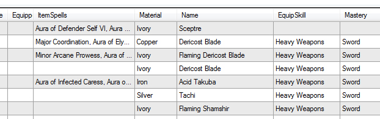
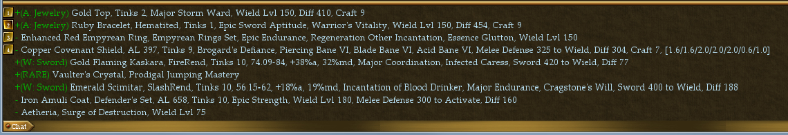
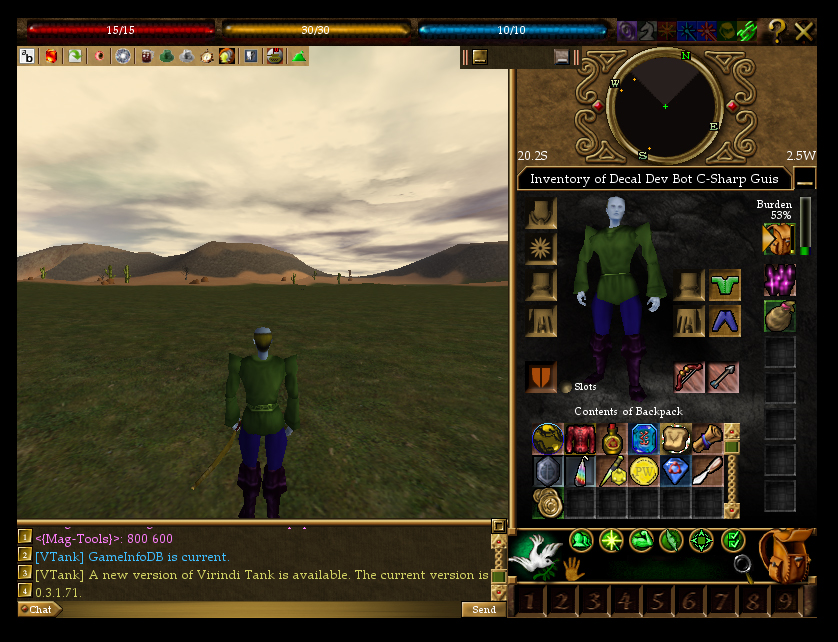

Installation:
# Download the dll to a directory of your choice, probably c:\games\decal plugins\ (or Documents\Decal Plugins)
# Open Decal Agent and on the right, click Add.
# Click browse and navigate to c:\games\decal plugins\ (or Documents\Decal Plugins)
# Select Magtools.dll and click save.
# Most features are disabled by default. Enable them in-game through the plugin.
----
[#Index](#Index)
----
{anchor:ManaTracker}**Mana Tracker**
* Shows equipped items and their activation state + active time remaining
* Green Circle: Active
* Red Circle: Inactive
* Gray Dot: Item has no spells
* Sicle (Reverse ?): Unknown (Waiting for server info...)
* Recharge
	* Recharges items when the words "Your xxx is low on mana" appear.
	* Tries to use a full mana stone first.
	* If no mana stones are found, uses the smallest mana charge in inventory.

{anchor:CombatTracker}**Combat tracker**
* Easily determine what elements monsters use against you.
* Determine your melee/missile and/or magic weaknesses against monsters.
* KB's shows the number of killing blows you dealt to targets (Not total target kills).
* Attacks is the total offensive attacks and your % of success.
* Evades is the total melee/missile attacks against you and your evade % of success vs melee and missile.
* Resists is the total magic attacks against you and your resist % of success vs magic.
* A.Surges/C.Surges are total Aetheria surges vs Total Attacks and Cloak Surges vs Total Successful Attacks vs you.
* If you /filter -spellcasting, aetheria tracking will not work.
* Festering/Affliction aetheria surges are not tracked.
* Successful debuffs are not tracked.
* Debuff cast failures/resists will register as a failed attack vs your target.

{anchor:InventoryItemTracker}**Inventory Item Tracker**
* Displays Hourly Net Profit in MMD's, based off salvage and pea collection. 
* Tracks the burn or collection rate for items including: Spellcomps, Healkits, Mana stones, Dark Isle Trophies, MMD's and more. 

{anchor:CorpseTracker}**Corpse Tracker**
* Track player/monster/fellow/your corpses (configurable)

{anchor:PlayerTracker}**Player Tracker**
* When and where players were last
* Where players portal out to

{anchor:ChatLogging}**Chat Logging**
* Log Area/Tells/Fellowship/General/Trade/Allegiance (configurable)

{anchor:InventoryPacker}**Inventory Packer**
* Used to automatically sort and pack all your inventory.
* Uses Virindi Tank Classic Looter profiles.
* Stacks items as it packs.
* Profile must be in "My Documents\Decal Plugins\Mag-Tools\" and named <CharacterName>.autopack.utl
* Type "/me autopack" to start the sort and pack process.
* Cntrl+P hotkey to start if you're using Virindi Hotkey System.
* Check out the sample profiles attached.
* Classic Looter profile limitations:
	* Only Keep # supported.
	* Keep # is the pack(s) the items that pass the rule belong to where 0 is your main pack and 1 is your first side pack.
	* An item that can go into both the first two side packs would have a keep number of 12.
	* An item that can go into side packs 3 through 5 would have a keep number of 345.
	* Do not use requirements that are red.
* Equipped items will not be auto packed.
* [My Mage.autopack.utl](Documentation_My Mage.autopack.utl)
* [My Melee.autopack.utl](Documentation_My Melee.autopack.utl)

{anchor:InventoryLogger}**Inventory Logger**
* Logs character inventory for viewing in Mag-SuitBuilder.
* Logs are saved when a character logs in, and logs out.
* Items are scanned as you pick them up for id data, if needed.
* Misc->Options->Inventory Logger Enabled.
* Tools->Inventory lets you search inventory using regex strings

{anchor:ItemInfoonIdent}**Item Info on Ident**
* When you right click an item, it shows you information about that item:
* The first char of the line is a + or -, which lets you know if the item would be looted under the current loot profile in vtank.
* Then (rule name), is the rule name. This only works if you're using vtank classic looter.

{anchor:VendorAutoBuy/SellonOpenTrade}**Vendor Auto Buy/Sell on Open Trade**
* Can be used to sell items (salvage/peas), or completely recomp your character.
* Uses Virindi Tank Classic Looter profiles.
* Uses Virindi Item Tool to do the work.
* When you open a trade with a vendor, the VendorName.utl file is loaded from "My Documents\Decal Plugins\Mag-Tools\"
* If a profile exists, buy/sell will automatically begin using the rules of the profile.
* Check out the sample profiles attached.
* Classic Looter profile limitations:
	* Keep, Keep #, and Sell are the only rules supported.
	* Keep # items are purchased before Keep items.
	* Do not use requirements that are red.
* Equip-able items will not be sold, but can be purchased.
* [Aun Amanaualuan the Elder Shaman.utl](Documentation_Aun Amanaualuan the Elder Shaman.utl)
* [Master Celdiseth the Archmage.utl](Documentation_Master Celdiseth the Archmage.utl)
* [Master Celdiseth the Archmage (More Tapers).utl](Documentation_Master Celdiseth the Archmage (More Tapers).utl) remove the (More Tapers) from the name to use.
* [Tunlok Weapons Master.utl](Documentation_Tunlok Weapons Master.utl)
* [Ellimar Jorning the Healer.utl](Documentation_Ellimar Jorning the Healer.utl)

{anchor:AutoAddToTrade}**Auto Add To Trade**
* Automatically adds items to the trade based on a profile that exists for the character you're trading with.
* Only works when you open a trade with someone, not when someone opens a trade with you.
* The profile is searched for in "My Documents\Decal Plugins\Mag-Tools\" matching their name.
* Classic Looter profile limitations:
	* Only Keep rules supported (Not Keep #).
	* Red requirements are supported.
* No equipped items will be added.
* Items are added at a rate of 10 per second.
* If you do not want to auto-add inscribed items, add a rule to your profile: String Value Match, Acts on: Inscription, String Value Pattern: ^$
* [I Hold Steel.utl](Documentation_I Hold Steel.utl)
	* With the above sample, any time you open a trade with a player named "I Hold Steel", you will automatically add all your full bags of salvaged steel to the list.
* [I Hold Unimbued Weapons.utl](Documentation_I Hold Unimbued Weapons.utl)
	* The above sample is for a mule that takes all unimbued weapons. We check that material >= 1 to see if its loot generated, and has 0 total tinks.
	* Because these rules have a red requirement, you may need to re-initiate the trade with the mule after a few seconds so the game has time to identify all of the weapons in your inventory.

{anchor:AutoTradeAccept}**Auto Trade Accept**
* Automatically accepts trade when trading with someone on your whitelist hits trade.
* Whitelist supports regex.
* Useful for muling, passing items to other mains that have accept gifts off, and to/from your trade bot.
* Management of the whitelist is currently manual.
* To Edit the white list
	* In AC, Open the Mag-Tools plugin and on the Misc tab, enable: Auto Trade Accept Enabled
	* Open Mag-Tools.xml
	* Look for a section that looks like:
  <AutoTradeAccept>
    <Enabled>True</Enabled>
  </AutoTradeAccept>
	* Replace that section with the following:
  <AutoTradeAccept>
    <Enabled>True</Enabled>
    <Whitelist>
      <Add>Hero.*</Add>
      <Add>HeroMules.*</Add>
    </Whitelist>
  </AutoTradeAccept>
* The following would automatically accept trades with chars that have names that begin with Hero or HeroMules.
* Replace the text inside with the exact names of your chars or regex expressions.

{anchor:AutoLooter}**Auto Looter**
* Automatically loots corpses and/or chests.
* Uses the current loaded loot profile in VTank to determine loot rules.
* Does not loot salvage rule items.
* Corpse looter can be enabled while running Virindi Tank without conflict.

{anchor: OneTouchHealing}**One Touch Healing**
* Assign a hotkey for one touch healing in the Virindi Hotkey window.
* If you have less than a 50% chance with kits and have food/potions, it will use a food/potion.

{anchor:AutoCrafting}**Auto Crafting**
* Auto Aetheria Revealer
	* Automatically uses Aetheria Mana Stone on Coalesced Aetheria
* Auto Shattered Key Fixer
	* Automatically uses Intricate Carving Tool on Shattered Keys for characters that have lockpick. Will automatically click the Yes confirmation box no matter what the percent chance of success is.
	* When an Asherons Call client window performs this action, it will semi-regain focus in a way that doesn't take your screen focus/cursor, but will return to normal focus CPU % even if you're using the FPS Manager of Mag-Tools. This is observable using windows task manager. Simply clicking the client and then off of the client again will kick back in the idle fps manager feature of mag-tools (or the default 10 fps that AC normally runs at when not focused).
* Auto Heart Carver
	* Automatically uses Intricate Carving Tool on Hearts for characters that have lockpick. Will automatically click the Yes confirmation box no matter what the percent chance of success is.
* Auto Key Ringer
	* Automatically adds Aged Legenary Keys to Burning Sands Keyring. Will not function within a distance of 10 from any Chest.
* Auto Key Deringer
	* Automatically removes Aged Legenary Keys from Burning Sands Keyring to make sure you have at least 1 key available for a meta. Will not function outside a distance of 10 from any Chest.
	* [DekeyAndPull v2.met](Documentation_DekeyAndPull v2.met)

{anchor:OnLogin/PeriodicCommands}**OnLogin/Periodic Commands**
* OnLogin automatically sends chat commands to the client immediately upon login
* OnLoginComplete sends chat commands once AC has fully loaded. 
* Periodic Command allows you to send commands at timed intervals (in minutes), offset from midnight

{anchor:MiscOptions/Filters/Client}**Misc.Options**
* Open Main Pack On Login: simply opens the main pack automatically when the character is finished logging in.
* Debugging Enabled: Prints exceptions to chat and logs them in a file in "My Documents\Decal Plugins\Mag-Tools\"
* Verbose Debugging Enabled: Helps diagnose where the plugin is spending the most time, or to provide state info. Outputs to chat
	* Ex: <{Mag-Tools}>: Export Persistent Stats: 54ms
* Log Out On Death

**Misc.Filters**
* Ability to filter many specific in-game messages.
* NPK Fails: "You fail to affect .. because you are not a player killer!"

**Misc.Client**
* Remove Window Frame On Login: Removes the windows title bar and window frame from the AC Client.
* Set/Del Window Position: Sets the startup position for an account/server pair. The AC Client window will be moved to these desktop coords 
	* Allows you to set a persistent spot on your desktop where a particular account@server belongs.
	* Makes it easy to position your clients in a tile or cascade manner.
	* Has separate settings cross server for those that play the same account on other servers.
	* Can be used on conjunction with Remove Window Frame On Login.
	* For fine tuning manually edit the My Documents\Decal Plugins\Mag-Tools\Mag-Tools.xmlon login.
* NoFocusFPSManager. The AC client will run at 10 fps when it doesn't have focus (you're alt tabbed). Setting a value other than 10 allows you to control what FPS the client runs at when in this state. Recommended value of 20.

**Misc.Tools**
* Ability to export all equipped items to the windows clipboard.
* Ability to export all inventory to the windows clipboard.

{anchor:CommandLine}**Command Line**
* /mt logoff and /mt logout (same function) logs out via command
* /mt send {"[enter,pause,space](enter,pause,space)"}
* /mt send cntrl+{"[C](C)"}
* /mt send {"[f4,f12](f4,f12)"}
* /mt send msg {"[keys to press](keys-to-press)"}
* /mt click {"[ok,yes,no](ok,yes,no)"}
* /mt click {"[X](X) [Y](Y)"}
* /mt get xy (gets the current cursor x y coordinates)
* /mt face {"[degrees](degrees)"}
* /mt {"[s](s)"}jump{"[w,z,x,c](w,z,x,c)"} {"[milliseconds](milliseconds)"} (s - shift, w - forward key)
* /mt fellow create {"[name](name)"}
* /mt fellow {"[open,close,disband,quit](open,close,disband,quit)"}
* /mt fellow recruit {"[name](name)"}
* /mt cast{"[p](p) [#,name](#,name) [on [target](on-[target)]"}
* /mt select{"[p](p) [item](item)"}
* /mt use{"[p](p) [item](item) [on [target](on-[target)]"}
* /mt use {"[closestnpc,closestvendor,closestportal](closestnpc,closestvendor,closestportal)"}
* /mt usei{"[p](p) [item](item) [on [target](on-[target)]"} (limits search to inventory items only)
* /mt usel{"[p](p) [item](item) [on [target](on-[target)]"} (limits search to landscape items only)
* /mt give{"[p](p) [item](item) to [target](target)"}
* /mt loot{"[p](p) [item](item)"}
* /mt drop{"[p](p) [item](item)"}
* /mt trade add{"[p](p) [item](item)"}
* /mt trade {"[accept,decline,reset,end](accept,decline,reset,end)"}
* /mt vendor addbuy{"[p](p) [item](item) [count](count)"}
* /mt vendor addsell{"[p](p) [item](item)"}
* /mt vendor {"[buy,clearbuy,sell,clearsell](buy,clearbuy,sell,clearsell)"}
* /mt combatstate {"[magic,melee,missile,peace](magic,melee,missile,peace)"}
* /mt autopack
* /mt dumpspells (writes to c:\mt spelldump.txt)
* /mt opt list
* /mt opt get {"[option](option)"}
* /mt opt set {"[option](option) [value](value)"}
* /mt opt remember {"[option](option)"}
* /mt opt restore {"[option](option)"}

* **Notes: **
* p postfix on command indicates partial matching on {"[item](item) [and [target](and-[target)]"}
* {"[on [target](on-[target)] limits [item](item)"} to inventory only
* For all /mt click events:
	* When an Asherons Call client window performs these actions, it will semi-regain focus in a way that doesn't take your screen focus/cursor, but will return to normal focus CPU % even if you're using the FPS Manager of Mag-Tools. This is observable using windows task manager. Simply clicking the client and then off of the client again will kick back in the idle fps manager feature of mag-tools (or the default 10 fps that AC normally runs at when not focused).

* **Examples: **
* /mt useip mote on mote
* /mt uselp key on door
* /mt usel Colloseum Key on Colosseum Chest

* /mt opt remember InventoryManagement.KeyRinger
* /mt opt set InventoryManagement.KeyRinger false
* /mt opt restore InventoryManagement.KeyRinger

----
{anchor:Index}Index:
[Mana Tracker](#ManaTracker)
[Combat Tracker](#CombatTracker)
[Inventory Item Tracker](#InventoryItemTracker)
[Corpse Tracker](#CorpseTracker)
[Player Tracker](#PlayerTracker)
[Chat Logging](#ChatLogging)
[Inventory Packer](#InventoryPacker)
[Inventory Logger](#InventoryLogger)
[Item Info on Ident](#ItemInfoonIdent)
[Vendor Auto Buy/Sell on Open Trade](#VendorAutoBuy_SellonOpenTrade)
[Auto Add to Trade](#AutoAddToTrade)
[Auto Trade Accept](#AutoTradeAccept)
[Auto Looter](#AutoLooter)
[One Touch Healing](#OneTouchHealing)
[Auto Crafting](#AutoCrafting)
[OnLogin/Periodic Commands](#OnLogin_PeriodicCommands)
[Misc Options/Filters/Client](#MiscOptions_Filters_Client)
[Command Line](#CommandLine)
----
Todo:
- Parse dispatch events to give more item id info.
- Audible alerts.

[Virindi Tank Classic Looter Profile](Virindi-Tank-Classic-Looter-Profile) *Made obsolete by Mag-Enhanced Virindi Tank Classic Looter