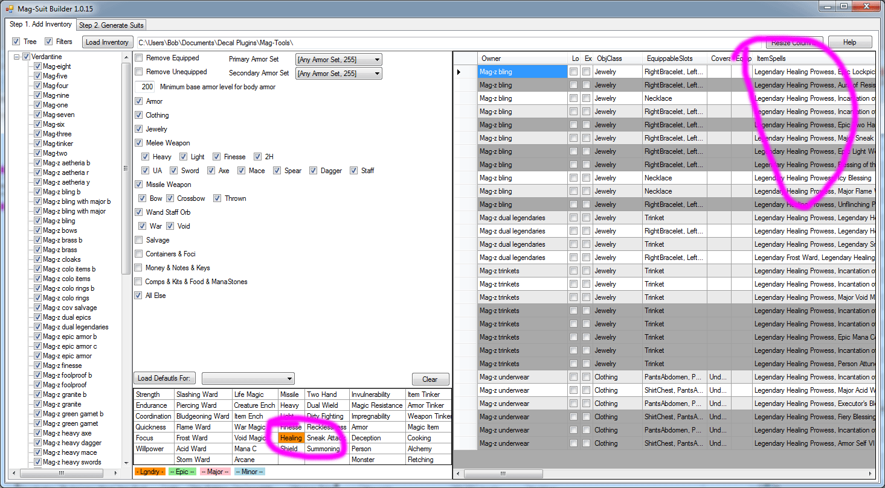
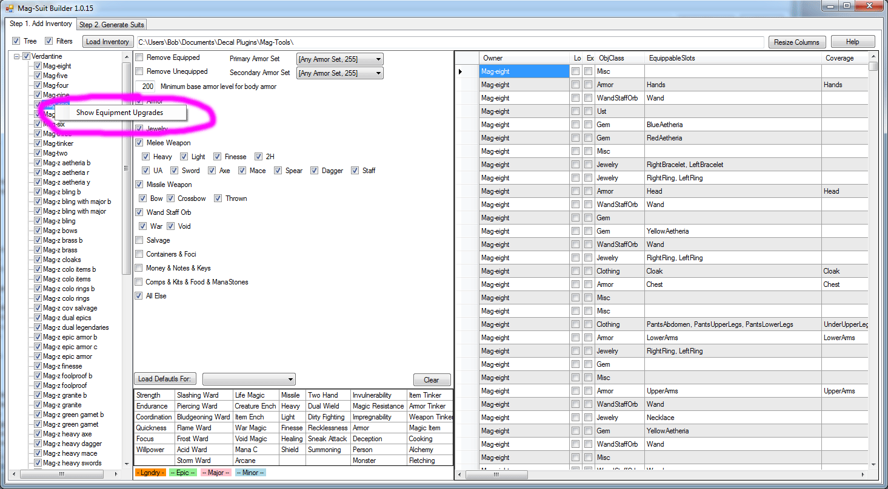
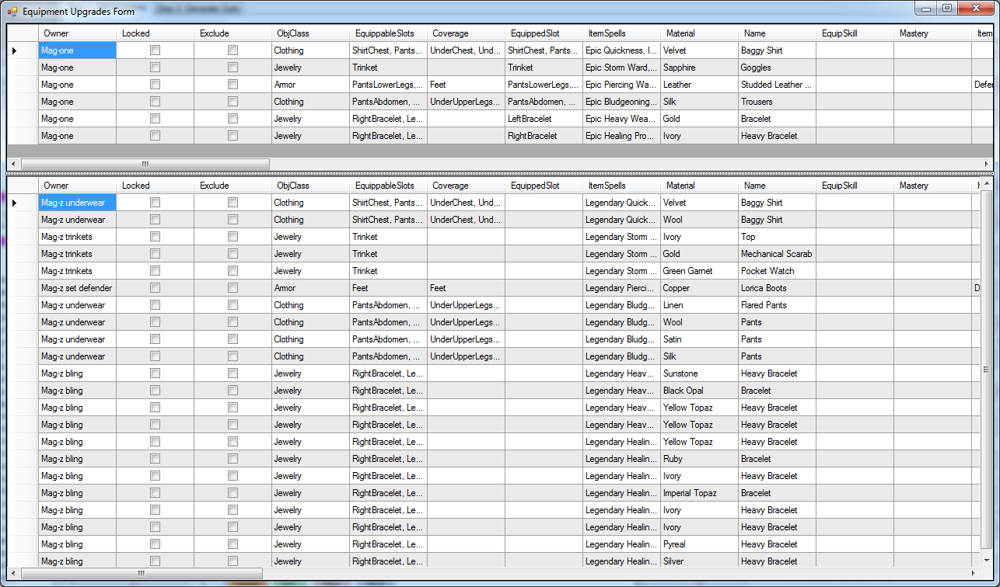
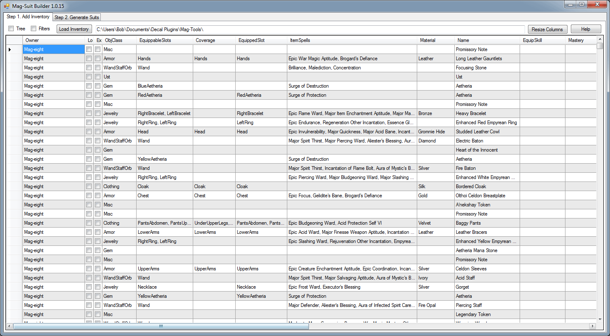
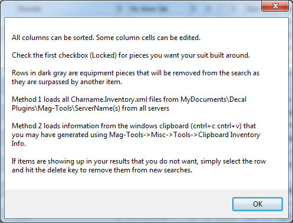

**Download**: [Here](http://magtools.codeplex.com/releases/view/83737)

// Bugs
// Spell compare is too slow, should be a hash compare
// AccessorySearcher thread pool keeps going even after user clicks stop.

**Tips:**
* Step 1: Use the first checkbox to lock items into place for your desired suit. Locking items in place drastically reduces build times.
* Step 2: The tighter the filters you set, the faster your best results will come.
* Step 3: Suits are built in two phases.
	* Phase 1: Suits of armor are built with no accessories (except underwear with impen)
	* Phase 2: Suits completed in Phase 1 are then accessorized.
	* Both phase 1 and phase 2 happen in parallel and will eat CPU.

* If you're unhappy with the amount of time its taking, enter in less items, or lock more items into place.
* I built this tool under the assumption that you will be able to fill missing epics, etc.. via jewelry and under clothing, but that you have a limited set of armor to chose from.

**Click Load Inventory on the top left. You can use check boxes to filter the inventory and can also click on the spell table below for additional filtering**

**Right click a character to bring up an equipment upgrades option**

**Shows you what upgrades you can do given the equipment you have access to**

**Uncheck the Tree and Filters boxes on the top left for a item only view**

